# Google Drive AI Import Design for NextOffice

## เป้าหมาย

ออกแบบระบบเชื่อมต่อ Google Drive เพื่อให้ AI เข้าถึงไฟล์หนังสือราชการ, Word, PDF และรูปภาพ แล้วนำเข้าสู่ NextOffice โดยแยกตามปีการศึกษา/ปีสารบรรณ และกลุ่มงานของโรงเรียน

ระบบควรทำได้ 4 เรื่องหลัก:

1. อ่านไฟล์จาก Google Drive แบบควบคุมสิทธิ์และตรวจซ้ำได้
2. แปลงไฟล์เป็นข้อความสำหรับ AI ทั้ง PDF, รูปภาพ, Google Docs และ Word
3. สร้าง `DocumentIntake`, ผลวิเคราะห์ AI, `InboundCase` และข้อมูลทะเบียนให้ผูกกับปีและกลุ่มงาน
4. ให้เจ้าหน้าที่ตรวจสอบ แก้ไขกลุ่มงาน/ปี และยืนยันก่อนลงทะเบียนจริง

## สภาพระบบปัจจุบันที่นำมาต่อยอด

ระบบ NextOffice มีฐานที่ใช้ต่อได้แล้ว:

- `DocumentIntake` เก็บไฟล์นำเข้า พร้อม `academicYearId`, `googleDriveFileId`, `googleDriveFolderId`, สถานะ OCR/classifier/AI
- `DocumentAiResult` เก็บ OCR text, metadata หนังสือราชการ, summary, deadline, action
- `OfficialWorkflowService` สร้าง `Document` และ `InboundCase` จากเอกสารที่ AI จำแนกว่าเป็นหนังสือราชการ
- `WorkGroup`, `WorkFunction`, `StaffAssignment` ใช้แยกกลุ่มงานและผู้รับผิดชอบ
- `AcademicYear` มีปีปัจจุบัน และ `InboundCase`/`DocumentRegistry` รองรับ `academicYearId`
- `SmartRoutingService` มี keyword mapping ไปยังกลุ่มงาน `academic`, `budget`, `personnel`, `general`
- `GoogleDriveService` ปัจจุบันเน้นอัปโหลดสำรองขึ้น Drive ยังไม่มีส่วน scan/download/import จาก Drive
- AI intake ปัจจุบันรองรับ PDF/รูปภาพเป็นหลัก ส่วน Word ควรเพิ่มตัวอ่านข้อความหรือแปลงไฟล์ก่อนเข้า AI

## สถาปัตยกรรมที่เสนอ

```mermaid
flowchart LR
  A["Google Drive folder"] --> B["DriveImportScheduler / Manual Scan"]
  B --> C["DriveImportService list files"]
  C --> D["Import Preview and Dedup"]
  D --> E["drive.import.process queue"]
  E --> F["Download or Export file"]
  F --> G["Store original in MinIO"]
  G --> H["Create DocumentIntake"]
  H --> I["Text extraction: OCR / DOCX / Google Docs"]
  I --> J["ClassifierService"]
  J --> K{"Official document?"}
  K -->|Yes| L["OfficialWorkflowService"]
  K -->|No| M["Non-official review queue"]
  L --> N["Document + InboundCase"]
  N --> O["Set AcademicYear + WorkGroup"]
  O --> P["Registry / Assignment / Dashboard"]
```



## โครงสร้างโฟลเดอร์ Google Drive

โฟลเดอร์เริ่มต้นที่ใช้กับระบบ:

```text
URL: https://drive.google.com/drive/folders/1OIwrshYMA9yBmYT_AXViENFJaltsT8P-?usp=sharing
Folder ID: 1OIwrshYMA9yBmYT_AXViENFJaltsT8P-
```

ระบบต้องไม่ hard-code ลิงก์นี้ไว้ในโค้ดถาวร ให้บันทึกเป็น `GoogleDriveImportSource` ขององค์กร และให้ผู้ดูแลระบบเปลี่ยนลิงก์ Google Drive ใหม่ได้จากหน้า Settings โดยการ paste folder URL ใหม่แล้วกด test connection/save

เมื่อเปลี่ยนลิงก์ใหม่:

- สร้าง source ใหม่หรือ update source เดิมด้วย `rootFolderUrl`/`rootFolderId` ใหม่
- ไฟล์ที่เคยนำเข้าจากลิงก์เดิมยังคงอยู่ใน NextOffice และไม่ถูกลบ
- sync รอบถัดไปอ่านจาก root folder ใหม่เท่านั้น ถ้าต้องการอ่านลิงก์เดิมต่อให้เปิด source เดิมเป็น active
- ต้อง reset `lastSyncToken`/cursor ของ source ที่เปลี่ยน root เพื่อไม่ให้ incremental sync ใช้ token ผิด folder
- ต้องแสดงประวัติว่าไฟล์แต่ละรายการมาจาก source/folder URL ใด เพื่อ audit ย้อนหลังได้

แนะนำให้ใช้ root folder สำหรับนำเข้าโดยเฉพาะ เช่น:

```text
NextOffice-Import/
  2569/
    01/
      15/
        general/
          รับ/
          ประชาสัมพันธ์/
        academic/
        budget/
        personnel/
      16/
        general/
        academic/
        budget/
        personnel/
    02/
      01/
        general/
        academic/
  2570/
    01/
      01/
        general/
        academic/
        budget/
        personnel/
```

แนวทาง mapping:

- `2569`, `2570` หรือ `ปีการศึกษา 2569` map เป็น `AcademicYear`
- เดือนให้ใช้เลข 2 หลัก เช่น `01` ถึง `12` หรือชื่อเดือนที่ map กลับเป็นเลขเดือนได้
- วันให้ใช้เลข 2 หลัก เช่น `01` ถึง `31`
- `academic`, `วิชาการ` map เป็น `WorkGroup.code = academic`
- `budget`, `งบประมาณ` map เป็น `WorkGroup.code = budget`
- `personnel`, `บุคคล` map เป็น `WorkGroup.code = personnel`
- `general`, `ทั่วไป`, `สารบรรณ` map เป็น `WorkGroup.code = general`
- ถ้าโฟลเดอร์ไม่มีชื่อกลุ่มงาน ให้ใช้ AI/keyword routing แล้วตั้งสถานะ `needs_review` เมื่อความมั่นใจต่ำ

โครงสร้างจัดเก็บไฟล์มาตรฐานในระบบให้ใช้:

```text
{academicYear}/{month}/{day}/{workGroupCode}/{fileName}
```

ตัวอย่าง:

```text
2569/01/15/general/หนังสือแจ้งประชุม.pdf
2569/01/15/academic/โครงการยกระดับผลสัมฤทธิ์.docx
2569/02/01/budget/ขออนุมัติจัดซื้อ.pdf
```

ลำดับการเลือกวันที่สำหรับสร้าง folder:

1. วันที่ในหนังสือจาก AI metadata `documentDate`
2. วันที่แก้ไขไฟล์ใน Google Drive `modifiedTime`
3. วันที่นำเข้าไฟล์ `importedAt`

ถ้าไฟล์ยังอ่านวันที่ไม่ได้ในรอบ scan ให้ใช้ `modifiedTime` ชั่วคราว และอัปเดต path ใหม่ได้หลัง AI extract วันที่เอกสารสำเร็จ หรือคง path เดิมไว้พร้อมบันทึก `documentDate` ใน metadata เพื่อไม่ให้ไฟล์ถูกย้ายบ่อยเกินไป

## รูปแบบการ sync

### 1. Manual Scan

ผู้ดูแลระบบเลือก Drive folder แล้วกด "สแกน" ระบบแสดงรายการไฟล์ก่อนนำเข้า:

- ไฟล์ใหม่
- ไฟล์ซ้ำ
- ไฟล์ที่เคยนำเข้าแล้วแต่ Drive มีการแก้ไข
- ไฟล์ที่อ่านไม่ได้หรือชนิดไฟล์ไม่รองรับ

เหมาะกับการนำเข้าย้อนหลังจำนวนมาก

### 2. Scheduled Incremental Sync

ตั้งเวลาเช่นทุกคืน 01:30 น. เพื่ออ่านไฟล์ใหม่จาก Drive root ที่กำหนดไว้ โดยใช้ cursor/page token หรือ `modifiedTime` ล่าสุดของแต่ละ source

สำหรับ requirement การทำงานจริง ให้ตั้ง ticker/fire เป็นทุกวันจันทร์ถึงศุกร์ ทุกชั่วโมงตั้งแต่ 09:00 ถึง 16:00 น.:

```text
09:00, 10:00, 11:00, 12:00, 13:00, 14:00, 15:00, 16:00
วันจันทร์-ศุกร์
Timezone: Asia/Bangkok
Cron: 0 0 9-16 * * 1-5
```

ตัวอย่างใน NestJS Schedule:

```ts
@Cron('0 0 9-16 * * 1-5', { timeZone: 'Asia/Bangkok' })
async scheduledDriveImport() {
  await this.driveImportService.syncActiveSources();
}
```

ข้อสำคัญ: แยกจาก scheduler สำรองไฟล์ขึ้น Drive ที่มีอยู่แล้ว เพื่อกัน loop นำเข้าแล้วสำรองกลับซ้ำ

### 3. Dry Run

โหมดทดลองที่อ่านรายชื่อและ mapping แต่ยังไม่สร้าง `DocumentIntake` เหมาะกับการตรวจโครงสร้าง Drive ก่อนเปิดใช้งานจริง

## Schema ที่ควรเพิ่ม

ควรเพิ่มตารางแยกสำหรับสถานะการนำเข้าจาก Drive แทนการยัดทุกอย่างใน `DocumentIntake`

```prisma
model GoogleDriveImportSource {
  id               BigInt   @id @default(autoincrement())
  organizationId   BigInt   @map("organization_id")
  name             String   @db.VarChar(255)
  rootFolderUrl    String?  @map("root_folder_url") @db.VarChar(1000)
  rootFolderId     String   @map("root_folder_id") @db.VarChar(255)
  rootFolderName   String?  @map("root_folder_name") @db.VarChar(255)
  folderMappingJson String? @map("folder_mapping_json") @db.LongText
  syncMode         String   @map("sync_mode") @db.VarChar(30) @default("manual")
  syncCron         String?  @map("sync_cron") @db.VarChar(100) // default: 0 0 9-16 * * 1-5
  syncTimezone     String?  @map("sync_timezone") @db.VarChar(100) // default: Asia/Bangkok
  lastSyncToken    String?  @map("last_sync_token") @db.Text
  lastSyncedAt     DateTime? @map("last_synced_at")
  isActive         Boolean  @map("is_active") @default(true)
  createdByUserId  BigInt?  @map("created_by_user_id")
  createdAt        DateTime @map("created_at") @default(now())
  updatedAt        DateTime @map("updated_at") @updatedAt

  @@index([organizationId, isActive])
  @@map("google_drive_import_sources")
}

model GoogleDriveImportFile {
  id                BigInt   @id @default(autoincrement())
  sourceId          BigInt   @map("source_id")
  organizationId    BigInt   @map("organization_id")
  driveFileId       String   @map("drive_file_id") @db.VarChar(255)
  driveFolderId     String?  @map("drive_folder_id") @db.VarChar(255)
  drivePath         String?  @map("drive_path") @db.VarChar(1000)
  fileName          String   @map("file_name") @db.VarChar(500)
  mimeType          String   @map("mime_type") @db.VarChar(150)
  md5Checksum       String?  @map("md5_checksum") @db.VarChar(64)
  size              BigInt?
  modifiedTime      DateTime? @map("modified_time")
  webViewLink       String?  @map("web_view_link") @db.VarChar(1000)
  academicYearId    BigInt?  @map("academic_year_id")
  workGroupId       BigInt?  @map("work_group_id")
  workFunctionId    BigInt?  @map("work_function_id")
  documentIntakeId  BigInt?  @map("document_intake_id")
  inboundCaseId     BigInt?  @map("inbound_case_id")
  status            String   @db.VarChar(30) @default("discovered")
  errorMessage      String?  @map("error_message") @db.Text
  mappingConfidence Float?   @map("mapping_confidence")
  importedAt        DateTime? @map("imported_at")
  createdAt         DateTime @map("created_at") @default(now())
  updatedAt         DateTime @map("updated_at") @updatedAt

  @@unique([organizationId, driveFileId, modifiedTime])
  @@index([organizationId, status])
  @@index([academicYearId, workGroupId])
  @@index([documentIntakeId])
  @@map("google_drive_import_files")
}
```

ควรพิจารณาเพิ่ม field สำหรับ query แยกกลุ่มงานโดยตรง:

- `InboundCase.targetWorkGroupId`
- `DocumentRegistry.workGroupId`

ถ้ายังไม่เพิ่ม field ทันที สามารถเก็บใน `CaseActivity.detail` ชั่วคราวได้ แต่การ filter รายงานตามกลุ่มงานจะช้ากว่าและยุ่งกว่า

## API ที่ควรเพิ่ม

```text
GET    /drive-import/sources
POST   /drive-import/sources
PATCH  /drive-import/sources/:id
POST   /drive-import/sources/test-link
POST   /drive-import/sources/:id/scan
GET    /drive-import/files?status=&academicYearId=&workGroupId=
POST   /drive-import/files/:id/import
POST   /drive-import/files/:id/retry
POST   /drive-import/files/bulk-import
GET    /drive-import/mappings
PATCH  /drive-import/files/:id/mapping
```

สิทธิ์:

- `ADMIN`: ตั้งค่า source, credentials, schedule, bulk import
- `CLERK`: scan, review, import, retry
- ผู้ใช้งานกลุ่มงาน: ดูเฉพาะเอกสารที่ถูกส่งถึงกลุ่มงานหรือได้รับมอบหมาย

`POST /drive-import/sources` และ `PATCH /drive-import/sources/:id` ควรรับได้ทั้ง `rootFolderUrl` และ `rootFolderId` ถ้าผู้ใช้ส่ง URL ให้ backend extract folder ID จากรูปแบบ เช่น:

```text
https://drive.google.com/drive/folders/{folderId}
https://drive.google.com/open?id={folderId}
```

ถ้า URL ไม่ใช่ Google Drive folder หรือระบบไม่มีสิทธิ์อ่าน ให้ตอบ 400 พร้อมข้อความให้แชร์ folder กับบัญชีที่ระบบใช้เชื่อมต่อ Google Drive

## Service และ processor ที่ควรเพิ่ม

```text
apps/api/src/drive-import/
  drive-import.module.ts
  controllers/drive-import.controller.ts
  services/drive-import.service.ts
  services/drive-reader.service.ts
  services/drive-mapping.service.ts
  services/document-text-extractor.service.ts
  dto/

apps/api/src/queue/processors/drive-import.processor.ts
```

หน้าที่:

- `DriveReaderService`: list, download, export Google Docs
- `DriveMappingService`: map path/file metadata เป็น academic year และ work group
- `DocumentTextExtractorService`: แปลงไฟล์เป็นข้อความ
- `DriveImportProcessor`: import ไฟล์ทีละรายการแบบ queue, retry ได้, ไม่ทำให้ API request ค้าง

## File handling

| ชนิดไฟล์ | วิธีอ่านที่เสนอ |
|---|---|
| PDF | ใช้ `OcrService.extractText()` เดิม หรือถ้าเป็น text PDF ใช้ parser ก่อนแล้วค่อย fallback OCR |
| JPG/PNG/WebP | ใช้ `OcrService.extractText()` เดิม |
| Google Docs | export เป็น `text/plain` สำหรับ AI และ export เป็น PDF เพื่อเก็บต้นฉบับสำเนา |
| DOCX | เพิ่ม library เช่น `mammoth` เพื่ออ่านข้อความ และเก็บไฟล์ต้นฉบับใน MinIO |
| DOC เก่า | แปลงด้วย LibreOffice headless เป็น DOCX/PDF ก่อน หรือ mark `needs_conversion` |

หมายเหตุ: `INTAKE_MIMES` ปัจจุบันรองรับ AI pipeline เฉพาะ PDF/รูปภาพ ส่วน Word อยู่ใน attachment/store-only ดังนั้นงานนี้ควรเพิ่ม text extractor สำหรับ Word โดยตรง

## Flow การนำเข้าไฟล์หนึ่งรายการ

1. `scan` พบไฟล์ใน Drive และสร้าง `GoogleDriveImportFile(status = discovered)`
2. ระบบคำนวณ mapping จาก path:
   - ปีจาก folder หรือวันที่เอกสาร
   - กลุ่มงานจาก folder หรือ keyword/AI
3. ผู้ใช้กด import หรือ bulk import
4. processor ดาวน์โหลดไฟล์จาก Drive
5. บันทึกไฟล์ต้นฉบับลง MinIO:

```text
google-drive/{organizationId}/{academicYear}/{month}/{day}/{workGroupCode}/{driveFileId}/{fileName}
```

6. สร้าง `DocumentIntake`:
   - `sourceChannel = google_drive_import`
   - `organizationId`
   - `academicYearId`
   - `googleDriveFileId`
   - `googleDriveFolderId`
   - `storagePath`
   - `sha256`
7. ดึงข้อความจากไฟล์และบันทึก `DocumentAiResult.extractedText`
8. เรียก `ClassifierService`
9. ถ้าเป็นหนังสือราชการ เรียก `OfficialWorkflowService.process(intakeId)`
10. หลังสร้าง case แล้ว update:
   - `InboundCase.academicYearId`
   - `InboundCase.targetWorkGroupId` ถ้าเพิ่ม field
   - `GoogleDriveImportFile.documentIntakeId`
   - `GoogleDriveImportFile.inboundCaseId`
   - `GoogleDriveImportFile.status = imported`
11. ถ้าไม่ใช่หนังสือราชการ ให้เข้า review queue หรือ knowledge import ตามประเภทที่เลือก

## การแยกตามปี

ลำดับการตัดสินปี:

1. Folder path ระบุปีชัดเจน เช่น `2569`, `ปีการศึกษา 2569`
2. วันที่ในหนังสือจาก AI metadata `documentDate`
3. วันที่แก้ไขไฟล์ใน Drive `modifiedTime`
4. ปีปัจจุบันจาก `AcademicYear.isCurrent`

ควรเก็บ `mappingConfidence` และ `mappingReason` เพื่อให้เจ้าหน้าที่ตรวจสอบได้ว่าระบบเลือกปีจากอะไร

## การแยกตามกลุ่มงาน

ลำดับการตัดสินกลุ่มงาน:

1. Folder path ระบุกลุ่มงานชัดเจน
2. กฎ keyword ของ `SmartRoutingService`
3. AI classification จากหัวเรื่อง, summary, extracted text
4. fallback เป็น `general` พร้อมสถานะ `needs_review`

เกณฑ์ที่เสนอ:

- confidence >= 0.75: import ได้อัตโนมัติ
- 0.45 ถึง 0.74: import ได้ แต่แสดง badge "ควรตรวจสอบ"
- ต่ำกว่า 0.45: ต้องให้เจ้าหน้าที่เลือกกลุ่มงานก่อน import

## UI ที่ควรเพิ่ม

### หน้า Settings: Google Drive Import

ส่วนประกอบ:

- ตั้งค่า root folder URL โดย paste link ได้ เช่น `https://drive.google.com/drive/folders/1OIwrshYMA9yBmYT_AXViENFJaltsT8P-?usp=sharing`
- แสดง folder ID ที่ extract ได้: `1OIwrshYMA9yBmYT_AXViENFJaltsT8P-`
- ปุ่มเปลี่ยนลิงก์ใหม่ โดยต้อง test connection ก่อน save
- เก็บ source เดิมไว้เป็น inactive ได้ เพื่อ audit หรือกลับมาเปิดใช้อีกครั้ง
- เลือกองค์กร
- เลือก mode: manual หรือ scheduled
- ตั้ง schedule ค่าเริ่มต้นเป็นจันทร์-ศุกร์ เวลา 09:00-16:00 ทุกชั่วโมง (`0 0 9-16 * * 1-5`, `Asia/Bangkok`)
- ตั้ง mapping ชื่อ folder กับปี/กลุ่มงาน
- ปุ่ม test connection
- ปุ่ม dry run

### หน้า Drive Import Queue

ตารางควรมี:

- ชื่อไฟล์
- path ใน Drive
- ปีที่ระบบเลือก
- กลุ่มงานที่ระบบเลือก
- ชนิดไฟล์
- สถานะ: discovered, skipped_duplicate, importing, imported, needs_review, failed
- confidence และเหตุผลการ mapping
- ปุ่ม preview, import, retry, override ปี/กลุ่มงาน

### หน้า Intakes และทะเบียนรับ

เพิ่ม filter:

- source channel = Google Drive
- ปีการศึกษา
- กลุ่มงาน
- สถานะ import
- เฉพาะไฟล์ที่ต้องตรวจสอบ

## ความปลอดภัยและ audit

- ใช้ credential ฝั่ง server เท่านั้น ไม่ส่ง access token ไป frontend
- จำกัด scope ของ Google Drive ให้น้อยที่สุดตามรูปแบบใช้งาน
- แนะนำใช้บัญชี service account หรือ OAuth refresh token ของบัญชีองค์กรที่เป็นเจ้าของ folder นำเข้า
- ทุก endpoint ต้องผ่าน `JwtAuthGuard` และ scope ด้วย `organizationId`
- เก็บ audit log เมื่อ scan, import, retry, override mapping
- ไม่เปิด public Drive link เป็นหลัก ให้ผู้ใช้ดูไฟล์ผ่าน file proxy ของ NextOffice
- ไม่เก็บ secret ใน DB แบบ plaintext ใช้ env หรือ secret manager

## Dedup และ versioning

เงื่อนไขกันซ้ำ:

- ถ้า `driveFileId + modifiedTime` เคยนำเข้าแล้ว ให้ skip
- ถ้า `driveFileId` เดิมแต่ `modifiedTime` ใหม่ ให้สร้างเป็น version ใหม่หรือ mark `updated_in_drive`
- ถ้า checksum `sha256` ซ้ำกับไฟล์เดิม ให้ skip แม้อยู่คนละ folder

สำหรับ MVP ให้เลือกแบบง่าย:

- ไฟล์เดียวกันและยังไม่แก้ไข: skip
- ไฟล์เดียวกันแต่แก้ไข: ให้ขึ้น review ก่อนนำเข้า version ใหม่

## ข้อควรระวังจากระบบเดิม

- `ai.ocr.extract` processor ปัจจุบันเป็น placeholder ในบาง flow ดังนั้น Drive import ควรทำ OCR/text extraction ใน processor ใหม่โดยตรง
- `GoogleDriveService` ปัจจุบันมีเฉพาะ upload/ensure folder ควรเพิ่ม read/list/download/export แยกเมธอดให้ชัด
- หน้า UI บางจุดระบุ DOCX แต่ AI pipeline ยังไม่ได้อ่าน DOCX โดยตรง ต้องเพิ่มตัวอ่านข้อความ Word
- Backup ขึ้น Drive และ Import จาก Drive ต้องแยก source/status เพื่อกัน import loop
- ควร normalize `storagePath` ที่เป็น `bucket/path` ก่อนเรียก MinIO เสมอ

## แผนทำงานเป็นเฟส

### Phase 1: MVP นำเข้า PDF/รูปภาพ

- เพิ่ม schema `GoogleDriveImportSource` และ `GoogleDriveImportFile`
- เพิ่ม Drive read/list/download
- เพิ่ม manual scan, preview, import queue
- รองรับ PDF/รูปภาพ
- สร้าง `DocumentIntake` และเรียก AI pipeline
- ตั้งค่า `academicYearId` และกลุ่มงานจาก folder path

### Phase 2: Word และ Google Docs

- เพิ่ม `DocumentTextExtractorService`
- รองรับ DOCX ด้วย `mammoth`
- รองรับ Google Docs export เป็น text/PDF
- เพิ่ม override mapping ใน UI

### Phase 3: Scheduled sync และรายงาน

- เพิ่ม scheduler incremental
- เพิ่ม retry/stuck-job reset
- เพิ่ม dashboard จำนวนไฟล์นำเข้าแยกปี/กลุ่มงาน/status
- เพิ่ม audit log

### Phase 4: Workflow ลึกขึ้น

- เพิ่ม `InboundCase.targetWorkGroupId` และ `DocumentRegistry.workGroupId`
- ผูกกับงานมอบหมายและรายงานภาระงาน
- เพิ่ม policy สำหรับ auto-register หรือ human approval ก่อนลงทะเบียน

## Acceptance criteria

- ผู้ดูแลระบบตั้งค่า Drive folder ได้
- กด scan แล้วเห็นไฟล์ใน Drive พร้อมปี/กลุ่มงานที่ระบบเดา
- ไฟล์ PDF/รูปภาพถูกนำเข้าเป็น `DocumentIntake` และ AI อ่านข้อมูลได้
- ไฟล์ Word/Google Docs ถูกดึงข้อความเข้า AI ได้หลัง Phase 2
- ไฟล์ซ้ำไม่ถูกสร้างซ้ำ
- หนังสือราชการถูกสร้างเป็น `InboundCase` และ filter ตามปี/กลุ่มงานได้
- เจ้าหน้าที่ override ปี/กลุ่มงานก่อน import หรือ retry หลัง error ได้
- การนำเข้าไม่ทำให้ backup ขึ้น Drive วนกลับมานำเข้าซ้ำ
